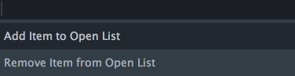
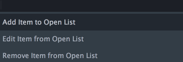

#HiveOpener

## 综述

这是一个Sublime Text插件，你可以使用它在Sublime Text中方便快速地打开文件、文件夹或网址。当然，前提是你需要事先配置好指定文件、文件夹或网址的基本信息。一切都很简单，让我们先从安装说起吧。

## 安装

本插件支持Windows/OSX双平台，同时支持较新版本的ST2/ST3，但为了最佳体验，建议使用ST3。

你可以选择以下任一种方法安装本插件。但是请留意，如果你正在使用的是ST2，你可能需要重新启动ST2以让插件加载生效。

### 方法一：使用Package Control自动安装

我们推荐使用[package control](https://packagecontrol.io/)来安装ST插件。要安装本插件，执行以下步骤：

 - 执行菜单命令`Tools(工具) > Command Palette(命令面板)`，然后输入`Package Control: Install Package`
 - 在随后弹出的面板中搜索`HiveOpener`进行安装即可

### 方法二：手动安装

首先，用`git`命令克隆本插件，或直接下载并解压本插件。然后将文件夹重命名为`HiveOpener`，拷贝或剪切该文件夹。执行菜单命令`Browse Packages`，打开 `Packages`目录，将事先拷贝的`HiveOpener`文件夹粘贴至那个目录即可。

安装成功后，你可以在`Tools`主菜单项下看到多了一个`Hive Opener`子菜单项。

## 基本功能

### 添加/移除配置项

你可以通过这个功能添加或移除文件（文件夹、网址）信息，该功能对应菜单命令`Tools > HiveOpener > Manage Open List`。执行该菜单命令，弹出选项面板，如下所示：



选择`Add Item to Open List`，将弹出如下输入面板：


在此你可以输入希望打开的文件（文件夹、网址）路径信息，后跟**可选的**描述信息，路径信息和描述信息以` | `分隔，请看如下示例：

 - 添加文件（不包含描述）：`/etc/hosts`
 - 添加文件（包含描述）：`C:\Windows\System32\calc.exe | calc`
 - 添加文件夹（不包含描述）：`/Users/miusuncle/Desktop`
 - 添加文件夹（包含描述）：`/Users/miusuncle/ | home`
 - 添加文件夹（包含描述）：`/Users/miusuncle/Desktop | desktop`
 - 添加网址（不包含描述）：`http://sosilence.info/`
 - 添加网址（包含描述）：`www.baidu.com | baidu`

只有在操作系统中存在的文件（文件夹）或合法的网址才能成功添加到配置文件中。 添加文件不限于文本文件，你还可以添加像以`.exe|.pdf|.doc|.app`等后缀结尾的可执行文件或二进制文件等。

添加成功后，你可以在配置文件中查看已添加项。要打开配置文件，执行菜单命令`Tools > HiveOpener > Config Settings - User`即可。

将配置项添加到配置文件中，随后可以移除配置项。选择`Remove Item from Open List`，将打开二级面板，该面板会显示所有已添加配置项，在此你可以搜索过滤配置项进行移除操作，选中`<- Back`将返回到主面板。

(注：如果你没有添加任何配置项，你将看不到`Remove Item from Open List`选项。当然默认安装插件时有若干默认配置项，可以执行菜单命令`Tools > HiveOpener > Config Settings - Default`进行查看)

### 打开配置项

添加配置项后，接下来你可以使用本插件的核心功能了，即打开配置项。执行菜单命令`Tools > HiveOpener > Show Open List`，呈现在你面前的是一个包括所有配置项的列表面板。搜索过滤你希望打开的配置项吧，一切都是那样地自然顺手：

 - 文件夹（用户、桌面等常用目录）将在资源管理器（或Finder）中打开
 - 文本文件（备忘录、配置文件等）将在Sublime Text中打开
 - 可执行文件（像计算器、记事本、邮件客户端等）也得以迅速打开
 - 快速打开二进制文档（像PDF、DOCX什么的）也不是事了
 - 网址将在你设置的默认浏览器中打开（再也没有比这个访问[王阿姨博客](http://sosilence.info/)更快捷的方法了）

## 扩展功能

除了以上添加、移除配置项的方法外，你还可以通过其他快捷途径添加或移除操作。

- 鼠标右击当前在ST中激活文件的标签（Tab），根据当前文件是否已添加到配置中，你将在弹出上下文菜单中看到`Add File to Open List`或`Remove File from Open List`命令

- 鼠标右击文本文件中出现的网址（注：ST2需要将当前光标定位到网址中），根据当前网址是否已添加到配置中，你将在弹出上下文菜单中看到`Add URL to Open List`或`Remove URL from Open List`命令

- 执行菜单命令`Tools > HiveOpener > Config Settings - User`，打开用户自定义配置文件，将鼠标移至你希望删除的配置项路径文本上并右击，你将在弹出上下文菜单中看到`Remove Dir from Open List`或`Remove File from Open List`或`Remove URL from Open List`命令（注：由于在ST2下使用此功能看不到及时反馈，所以不建议ST2用户使用此功能）

## 选项设置

细心的你可能会发现，执行菜单命令`Tools > HiveOpener > Options Settings - Default`，你将看到如下选项设置：

```json
{
    "show_edit_item_option": false,
    "peek_file_on_highlight": false,
    "copy_url_on_open": false,
    "open_binary_file_in_sublime": false
}
```

通常情况下，你不需要也不应该修改这些选项设置。为了减少疑虑和方便理解，以下简述这些选项设置的用途：

`show_edit_item_option: `是否显示编辑配置项选项，该值设为`true`的话，执行菜单命令`Tools > HiveOpener > Manage Open List`，你将看到如下面板：



可以看到，`Edit Item from Open List`选项已激活可用。

`peek_file_on_highlight: `列表配置项高亮选中时是否预览文件内容(该选项只在ST3中有效)

`copy_url_on_open: `打开网址时是否拷贝网址到剪贴板中

`open_binary_file_in_sublime: `执行打开操作时是否希望二进制文件在Sublime Text中打开

如果你希望更改默认选项设置，建议将默认设置拷贝到用户自定义选项设置文件中再进行覆盖设置操作。用户自定义选项设置文件可以执行菜单命令`Tools > HiveOpener > Options Settings - User`打开。

## 最佳实践

使用本插件的最佳姿势是利用快捷键，你可以执行菜单命令`Tools > HiveOpener > Key Bindings - Default`查看默认快捷键：

##### Windows

- 添加、移除配置项：`ctrl + alt + i`
- 打开配置项：`ctrl + alt + o`
- 打开配置文件：`alt + shift + i`

##### OSX

- 添加、移除配置项：`ctrl + cmd + i`
- 打开配置项：`ctrl + cmd + o`
- 打开配置文件：`alt + shift + i`

如果你希望修改默认快捷键，建议将默认快捷键拷贝到用户自定义快捷键文件中再重新设定。用户自定义快捷键文件可以执行菜单命令`Tools > HiveOpener > Key Bindings - User`打开。

另外，如果你希望打开**网址专用**配置项列表的话，添加以下配置到用户自定义快捷键文件中即可。

```json
{ "keys": ["f12"], "command": "hive_url_open" }
```

配置完毕后，按`F12`键，你将看到单独显示网址配置项的列表面板出来了。

## 题外话

平时工作中，由于经常性地需要打开一些常用的文件、目录和网址，作为ST重度使用用户，于是便有了这个插件的诞生。

最后，如果你也是ST的忠实粉丝，如果你认为这也是你觉得可(`Bi`)以(`Xu`)有的功(`Te`)能(`Xiao`)，现在就开始`Duang`起来吧！
